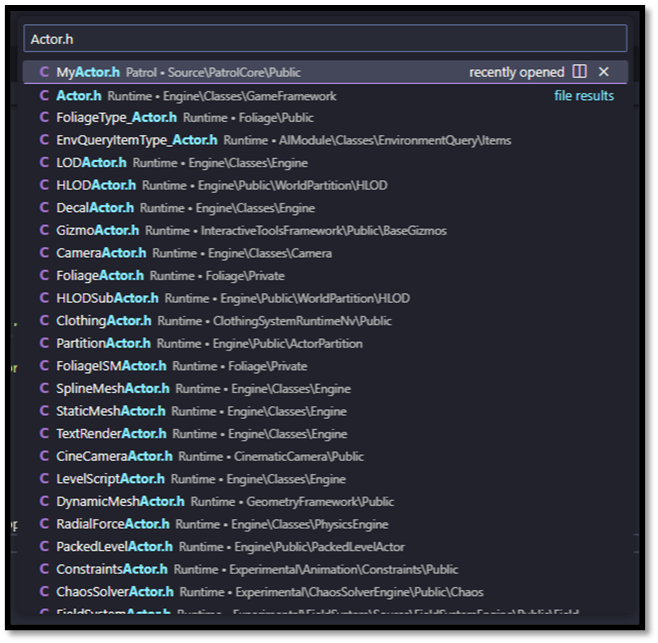
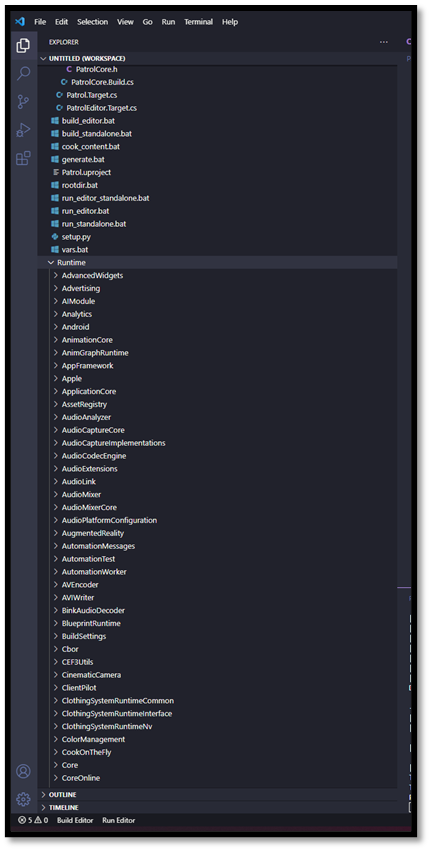
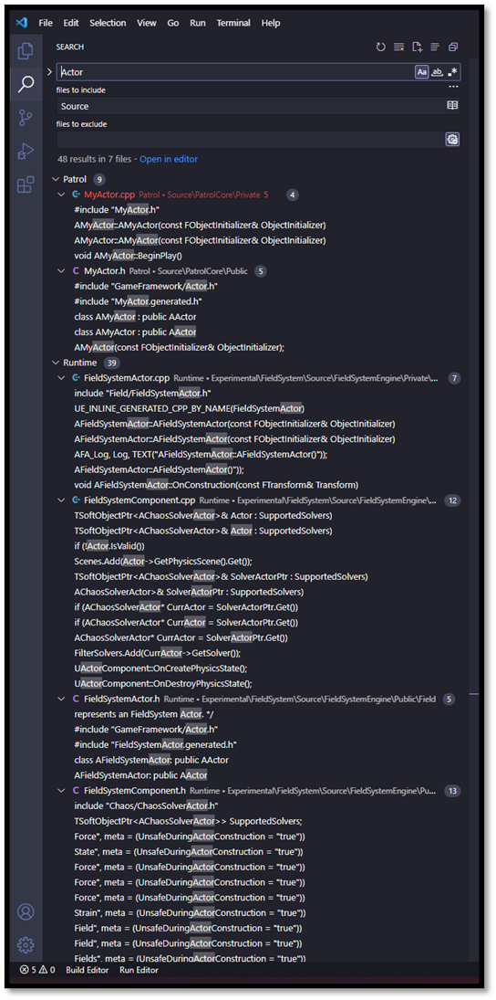
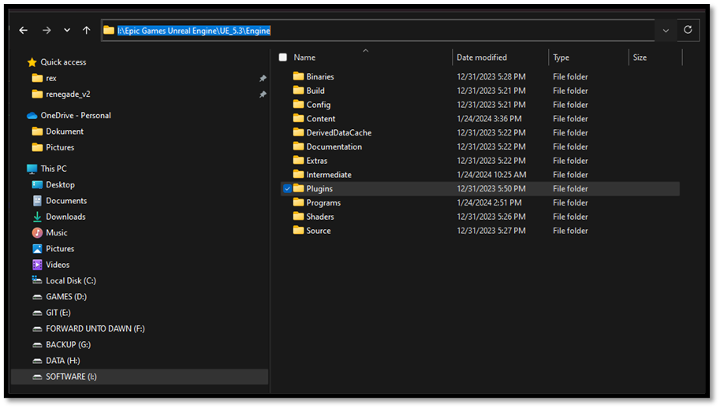

# Additional Workflow Items

This appendix collects the VS Code and engine-navigation habits that make working without a heavy
IDE practical. Console commands used to live here too; they have moved to the
[Iteration Speed](./iteration_speed.md) chapter, where they belong alongside Live Coding.

## Looking for files

- If you hit Ctrl+P, you can quickly browse to any file that's been included in the project.

## Creating a Code workspace

- You can add {UE-Root}/Engine/Source/Runtime directory to your project workspace so you have the Unreal source code at your fingertips.

If we add UE's {UE-Root}/Engine/Source/Runtime directory, then we'll also have the Engine source at our fingertips. The key distinction here is that where Visual Studio tries to be smart, VS Code just tries to be fast. With Visual Studio, you're dealing with IntelliSense, which has to parse the entire Engine codebase and run extensive static analysis, and then it has to reason about that codebase while working around the fact that huge chunks of it rely on a custom code generation process... and if you ask me, expecting it to be reliably correct and responsive is just too much to ask. Back when I was using Visual Studio, I found I couldn't rely on IntelliSense, and I'd end up just searching through the API documentation all the time. But the code itself contains the exact same documentation you can cut out the middle-man and Ctrl+P your way straight to an answer, faster than it takes for an IntelliSense completion window to appear. This approach keeps you in the driver's seat.

## Looking for symbols

- Use CTRL + SHIFT + F to search the entire codebase to see how a symbol is used or referenced

Once the engine source is in your workspace, that search box becomes a general-purpose answering
machine. Two uses of it come up constantly.

**Search for text you can see in the editor.** Any label, menu entry, tooltip or checkbox name in
the Unreal Editor is a string literal somewhere in the source. Type it into a codebase-wide search
and you land on the code behind that button. This is by far the fastest way to find out how a piece
of editor functionality actually works when you want to replicate or extend it. You are not
searching for an API whose name you already have to know, you are searching for the words on screen.

**Search for a log line.** When something logs a warning that does not tell you enough, copy the
message out of the log, strip out the parts that were formatted in at runtime (asset names, counts),
and search for the longest literal fragment that is left. You land on the exact `UE_LOG` call, which
tells you the conditions under which it fires. You can then put a breakpoint there and run again to
inspect the object that triggered it. This is often the only practical way to attribute a cook or
load warning that names no asset.

## Plugin directory

- Use the {UE-Root}/Engine/Plugins directory as a reference on how to structure Unreal modules within your project

A good source of example code is the Engine Plugins directory. If we limit our search there, we can find usage examples that are set up in the same way our project code should be.

## Documentation

- Use the Engine Source Code as documentation

I've found that if you treat the Engine source as documentation in and of itself, and if you optimize your workflow for browsing that source, you'll gain a much more intuitive understanding of it over time.

## Everything on the clipboard is text

One last thing, and it has been true since Unreal Engine 1. When you copy something in the editor
(Blueprint nodes, material graph nodes, actors selected in a level), what lands on your clipboard is
**plain text**. Paste it into any text editor and you get the full serialized description.

That has practical consequences. You can paste a node graph into a chat message so a colleague can
paste it straight back into their editor. You can save a setup in a text file for tomorrow. You can
diff two versions of something by pasting both and comparing. And when you are trying to understand
what a Blueprint node actually *is*, pasting it into a text editor tells you its class name, which is
then something you can search the engine source for, which brings us back to the point of this
whole appendix.