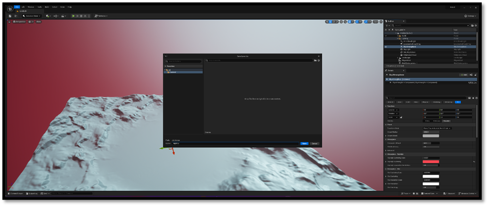

# Altering our project

As we get ready to showcase our project, I'm going to shake things up a bit and tweak the defaults to give it some extra flavor. When we fire up the "Standalone Editor" and "Standalone Game" for testing, we'll be making sure our special map and engine settings are all loaded up correctly.

- First let us alter the maps atmosphere.

- Save the map in the Content Browser

- Generate a unique project ID

- Setup target hardware

- Change the default map to our new map we just saved

