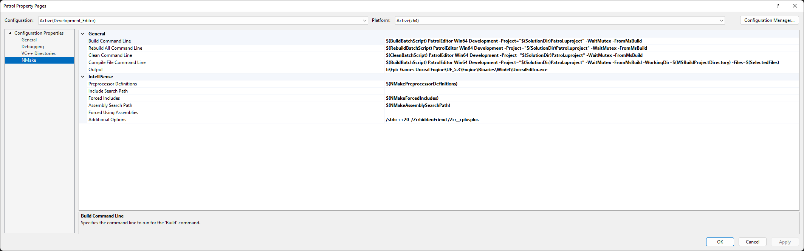
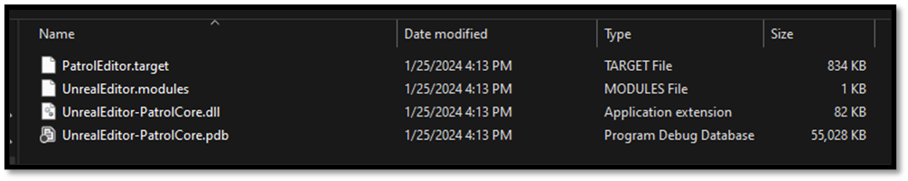

# Build an Unreal Project from Scratch

Now that we have an entry point to our project by setting up our primary module we have a project that is ready to be build from Source. We have done all this without the usage of Visual Studio or Unreal Editor, not because they are bad tools but just because this gives us a chance to see what's happening under the hood. Unreal uses the Visual C++ compiler and linker and it recommends Visual Studio as an officially supported IDE, but it does not actually use Microsoft's build system. Instead **Unreal has it's own cross-platform build system,** which is why we need to write those C# files to configure our target and its modules. When you generate Visual Studio project files, those solution and project files aren't actually an essential part of the build. They're just **Visual Studio compatible frontend for Unreal's build process.** If we navigate to `{UE-Root}/Engine/Build/BatchFiles` directory we can see a file called Build.bat. This just calls UnrealBuildTool.exe, which invokes builds. When you build your project in Visual Studio, it's essentially just running this Batch file. 



This batch file has 4 essential steps:
- **Setting up the environment** It checks if the batch file exists in the expected directory and sets up the environment for the build process.
- **Building the UnrealBuildTool** It verifies the presence of the UnrealBuildTool and compiles it if necessary, either using Visual Studio or dotnet, depending on the context.
- **Running the UnrealBuildTool** It executes UnrealBuildTool with the provided arguments, which typically include the game name, platform name, configuration name, and any additional arguments required for the build process.
- **Error Handling** It includes error handling mechanisms to detect and report errors that may occur during the build process, such as missing dependencies, compilation failures, or missing files.

## Unreal Build Tool

The **Unreal Build Tool** (UBT) is the program that builds Unreal source code across build configurations. Unreal supports Windows, macOS, Linux, iOS, Android, PlayStation, Xbox and VR/AR devices, and UBT hides the platform-specific differences between them behind one build system. Its job is to compile and link your code together with the engine code your project depends on. As we already discussed Unreal is split into many modules. Each module has a .build.cs file that controls how it is built, including options for defining module dependencies, additional libraries, include paths, etc. By default, these modules are compiled into DLLs and loaded by a single executable. Whether you get that modular layout or a single monolithic executable is decided by `LinkType` in your `.target.cs` file. Editor targets are modular so the editor can load and reload module DLLs, while shipping game targets are usually monolithic. There is also a machine-wide `BuildConfiguration.xml` (in `%APPDATA%\Unreal Engine\UnrealBuildTool\`) that lets you change UnrealBuildTool's own defaults, which we come back to in [Quality of Life](./quality_of_life_improvements.md). Anyway, an entire article could be written about UBT. For more information about UBT I would like to advise you to read the [Official Documentation](https://dev.epicgames.com/documentation/en-us/unreal-engine/unreal-build-tool-in-unreal-engine).

## Using UBT

We've already established that we don't require Visual Studio to build our project, we can leave it out of building our project too, while still making use of UBT. All we have to do is invoke Build.bat and pass in a few arguments. We need to tell it which Target we want to build, then we need to give it a platform and a build configuration. Then we just pass in the path to the .uproject file, and we can kick off the build. 

- Open your terminal
    - CTRL + Tilde (~)
    - Type `{UE-BatchFiles}/Build.bat`
        - e.g. `C:\Program Files\Epic Games\UE_5.8\Engine\Build\BatchFiles\Build.bat`
    - Define a Target that you would like to build
        - `{projectname}Editor`
    - Define a Platform that would like to build for
        - `Win64`
    - Define a build configuration
        - `Development`
    - Define a path to the .uproject
    - Define `-waitMutex` and `-NoHotReload`

The full command should look like this: 

```shell
{UE-BatchFiles}/Build.bat PatrolEditor Win64 Development "{project_path}/Patrol.uproject" -waitMutex -NoHotReload
```
*Note: if the path contains spaces, wrap it in straight double quotes (`"`) and start the command with `&`, PowerShell's call operator.*
```shell
& "{UE-BatchFiles}/Build.bat" PatrolEditor Win64 Development "{project_path}/Patrol.uproject" -waitMutex -NoHotReload
```

UnrealBuildTool can only build one target at a time, so `-waitMutex` tells it to wait for any in-progress build to finish instead of failing outright, which matters the moment you have a batch file and the editor both able to trigger builds.

`-NoHotReload` deserves more explanation than it usually gets, because the name misleads people. **Hot Reload** is a specific, older mechanism: when the editor is running and you build, UBT writes out uniquely-named DLLs (`UnrealEditor-PatrolCore-0002.dll` and so on) which the running editor then loads on top of the old ones. It works, it leaves those numbered files lying around, and it has largely been superseded. Passing `-NoHotReload` says "I am building from a terminal, nothing needs patching in place, just produce normal binaries."

That is **not** the same thing as giving up on fast iteration. The modern replacement for Hot Reload is **Live Coding**, which patches running code in memory and is on by default. It is triggered from the editor rather than from UBT, so it is unaffected by this flag. The [Iteration Speed](./iteration_speed.md) chapter covers when it is the right tool and when you still need a full rebuild.

Once the build gets going, we start getting build artifacts in the Intermediate directory. Eventually, Unreal Header Tool parses our source and spits out generated source files. UHT is looking for the `UCLASS`, `USTRUCT`, `UFUNCTION` and `UPROPERTY` macros and generating the reflection code that makes them mean anything at runtime. It is itself a C# program these days, which is part of why the .NET workload was not optional back in the setup chapter. Then everything gets compiled to object code, and finally our module is linked together into a DLL that the editor can load. We can see that DLL in the Binaries directory this file contains all the code we've written in our {modulename}Core module, in a compiled binary form. Next to that is the corresponding PDB, or symbol file this essentially contains debugging information so that symbols in the compiled binary version of our code can be traced back to the corresponding functions, variables, and other identifiers in the source code. We also get a .modules file, which is just a bit of metadata telling the editor which DLLs should be loaded for this module, and which Engine version those DLLs were compiled against this is why you'll get an error if you build editor binaries on one version of Unreal, then try to open them with a different version. There's also a .target file, which is just more metadata spit out by the build system which is not important for us.



## Wrap up

That's it for building our project, in the [next section](./opening_unreal_project_from_scratch.md) everything will come together, and we will start opening our project in Editor, Editor Standalone and Running our game. 