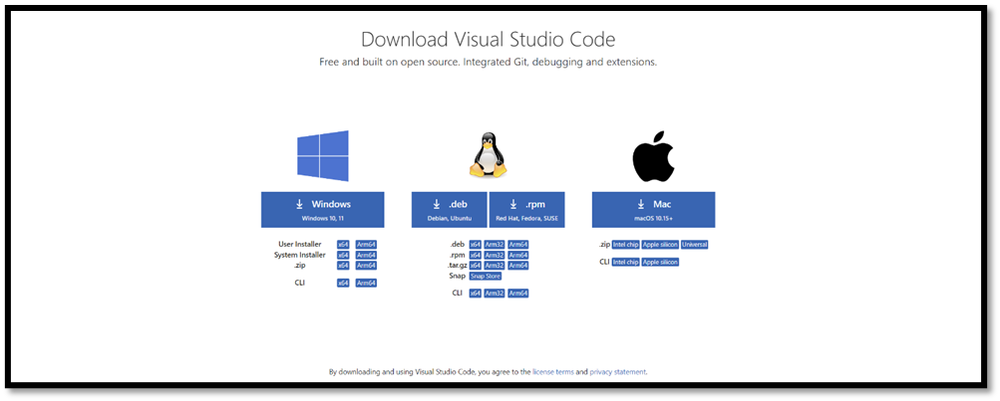
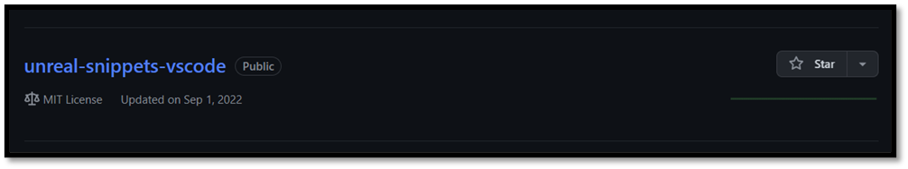
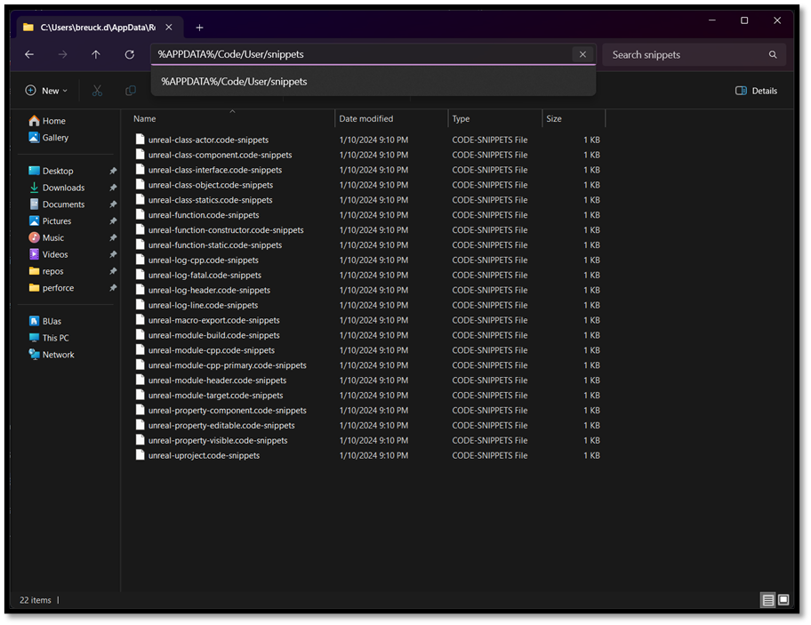
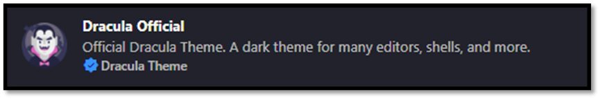
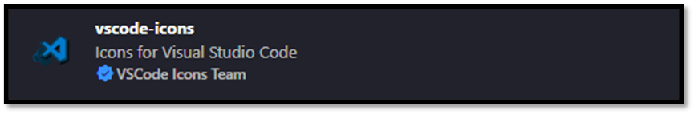
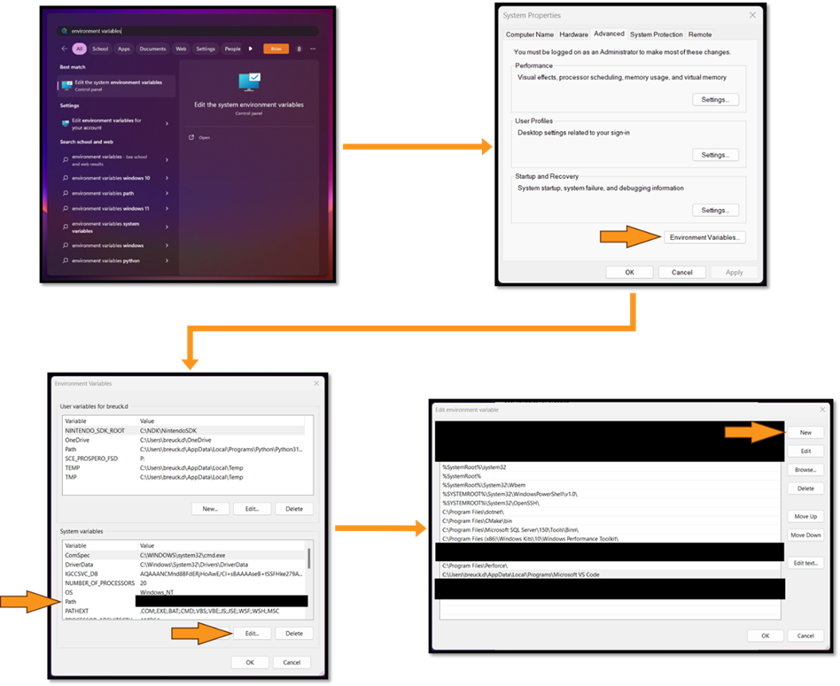
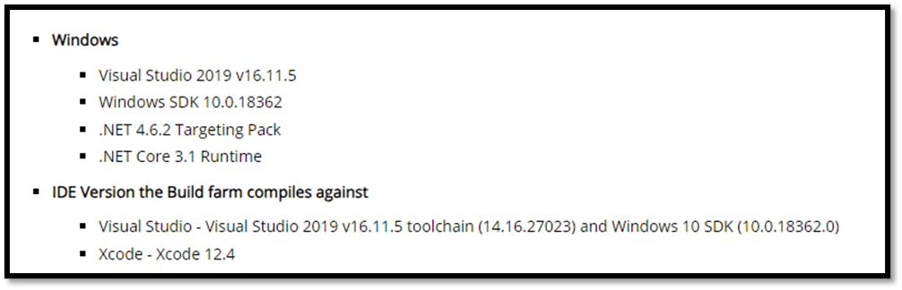
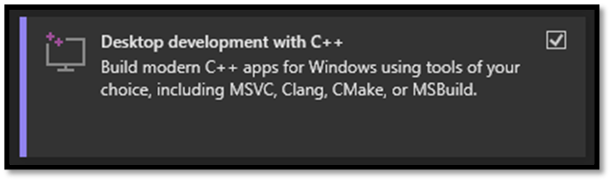
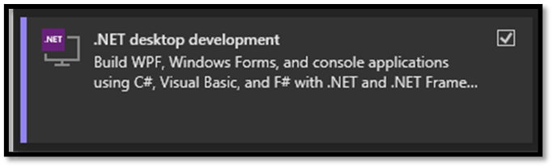

# Development Tools

Before we get to game engines and compilers, two **tools every developer needs: a trusty text editor and a reliable terminal.** And guess what? With VS Code, you get both bundled in one neat package! Now, I know there are alternatives out there like Sublime Text and Cmder, but for this walkthrough, I'll be sticking with VS Code, my go-to choice when working with Unreal Engine.

### Why VS Code, you ask?

Let me break it down for you. VS Code doesn't clutter your workspace, it's highly customizable to match your preferences, packed with awesome features, and incredibly lightweight and responsive. Even when dealing with massive codebases like Unreal, it won't drag you down.

### What about Visual Studio?

Unreal Engine integrates with Visual Studio, and that integration is good: you can change C++ and see the result without restarting the editor. That mechanism is called **Live Coding**, it is on by default, and it is not a Visual Studio feature at all. It is triggered from the editor with `Ctrl+Alt+F11` and works exactly the same from VS Code. The [Iteration Speed](./iteration_speed.md) chapter covers what it can and cannot patch.

What is worth understanding is that for Unreal, **the Visual Studio IDE serves primarily as a frontend.** Unreal does not use Visual Studio's build system; it uses its own, driven by a batch script that invokes builds for your target platform. The solution and project files that get generated are a Visual Studio compatible view onto that process, not the process itself.

Visual Studio's *installer*, however, is how you get the C++ toolchain, the Windows SDKs and the .NET runtime that Unreal actually needs on Windows. So even if you never open the IDE, you still install it.

## Installing VS Code

Here's how to get started:

- Head over to the [official VS Code website](https://code.visualstudio.com) and download the installer.
- Run the installer and follow the setup instructions.
- Once installed, let's beef up the IDE with some essential extensions:
    - C++ IntelliSense: Your coding buddy that provides smart suggestions and auto-completions.
    - Visual Studio Keymaps: For those familiar shortcuts to keep your workflow smooth.
    - Tasks: see [quality of life improvements](./quality_of_life_improvements.md).

*Note: Epic's own [VS Code setup page](https://dev.epicgames.com/documentation/en-us/unreal-engine/setting-up-visual-studio-code-for-unreal-engine) currently recommends Microsoft's **C/C++ Extension Pack** (which bundles C++ IntelliSense) and the **C#** extension. The latter matters because UnrealBuildTool and friends are C# programs, so you get IntelliSense in `.Build.cs` and `.Target.cs` files too. That matters more than it sounds: those are the files this book spends two chapters writing.*

### VS Code - Unreal Snippets

Make your life easier by setting up Unreal snippets in VS Code:

- Grab or clone the [Unreal Snippets repository](https://github.com/Dyronix/unreal-snippets-vscode) onto your machine.
- Navigate to `%APPDATA%/Code/User/snippets`.
- Paste the repository contents (excluding the .git folder) into this directory.
- Restart VS Code (if it's open) to apply the changes. 

### VS Code - UEProjectGenerator

If you would rather [generate your project](./introduction.md#two-ways-to-get-there) than write it by hand, install the [UEProjectGenerator](https://marketplace.visualstudio.com/items?itemName=breda-university-games.ueprojectgenerator) extension from the marketplace. It ships with the same Unreal snippets (`uca`, `ull`, `umb` and friends), so you can skip copying the snippets repository above. Either route gives you the snippets the rest of this book uses.

### [Optional] VS Code - Theme

Add a touch of personality to your coding environment for extra cuteness:

- Customize your VS Code with a sleek theme like Dracula.
- Enhance it further with vscode-icons for some visual flair.

### [Optional] VS Code - Launch from Windows Explorer (Windows Only)

Here is how to set that up:

- Open the Start menu and search for "environment variables."
- Access the "Edit the system environment variables" dialog.
- In the environment variables section, edit the PATH variable.
- Add the path to your VS Code installation directory (typically located at 
    - `C:\Users\${username}\AppData\Local\Programs\Microsoft VS Code`).
- Open the Task Manager and restart Explorer.exe to finalize the changes (this will refresh everything related to Windows Explorer).

That covers the editor. The other half of the setup is the toolchain Unreal actually compiles with, which is where Visual Studio comes in.

## Installing Visual Studio

Installing Visual Studio is not as simple as taking the latest version. Unreal has specific requirements about the version of Visual Studio *and* which of its components are installed, and those requirements move with every engine release.

Two pages are authoritative, and they are the ones to check rather than trusting anything written here:

- [Hardware and Software Specifications](https://dev.epicgames.com/documentation/en-us/unreal-engine/hardware-and-software-specifications-for-unreal-engine): which Visual Studio version Epic expects.
- [Setting Up Visual Studio Development Environment for C++ Projects](https://dev.epicgames.com/documentation/en-us/unreal-engine/setting-up-visual-studio-development-environment-for-cplusplus-projects-in-unreal-engine): the exact workloads and individual components, by name.

The [Unreal Engine 5.8 release notes](https://dev.epicgames.com/documentation/unreal-engine/unreal-engine-5-8-release-notes) also list the IDE and SDK versions Epic's build farm compiled that release with, which is what the screenshot below shows.

For Unreal Engine 5.8, Epic's guidance is **Visual Studio 2026 for general development**, with **.NET 10.0** as both the minimum and the recommended version. Visual Studio 2022 version 17.14 or later still builds 5.8, and is still required for Nintendo platforms and for AGDE below v26.1.102, so if you already have 2022 installed and working, you are not stranded.

Matching your team is worth more than matching Epic exactly. Build problems that only reproduce on one machine are very often a toolchain difference, so agreeing on one version across a team removes an entire category of "works on mine".

Download the installer from the [official website](https://visualstudio.microsoft.com/vs/) and run it. In the **Workloads** tab, select:

- **Desktop development with C++**: the compiler, linker and debugger.
- **Game development with C++**: the Unreal-specific pieces.
- **.NET desktop development**: UnrealBuildTool, UnrealHeaderTool and most of Unreal's other tools are C# programs. You need this to run them, and you need it if you ever want to build them from source.

Then open **Installation details**, expand *Game development with C++*, and make sure these individual components are ticked:

- **C++ profiling tools**
- **C++ AddressSanitizer**
- **Windows 10 or 11 SDK (10.0.18362 or newer)**
- **Unreal Engine installer**

Before proceeding to the [next section](./creating_unreal_project_from_scratch.md), verify that your Visual Studio version, .NET version and Windows SDK match what the two pages above ask for. Getting this wrong does not produce a clear error message. It produces a confusing link failure three chapters from now. You can also take a look at the [recommended workflow](./official_development_setup.md) by Epic on how to set up a project for beginners.

### Debugging from VS Code

The book sets up VS Code to *build* in the [Quality of Life](./quality_of_life_improvements.md) chapter, but building is only half of it. Sooner or later you will want to stop on a breakpoint.

You do not have to write a `launch.json` by hand. Unreal generates one for you:

- From the editor: **Tools > Refresh Visual Studio Code Project**
- Or from the command line: `GenerateProjectFiles.bat -vscode`

Either produces a `.code-workspace` file in your project folder along with launch configurations. Pick the **Development Editor** variant in the configuration dropdown (not the standalone or shipping ones) and press **F5** to build and launch under the debugger. The editor must not already be running when you start a debug session, since the debugger needs to launch the process itself.

For more information about setting up Visual Studio and some additional tips and tricks on how to modify Visual Studio as an IDE, you can visit the official documentation of Unreal: [Unreal Engine: Visual Studio Setup](https://dev.epicgames.com/documentation/en-us/unreal-engine/setting-up-visual-studio-development-environment-for-cplusplus-projects-in-unreal-engine)
