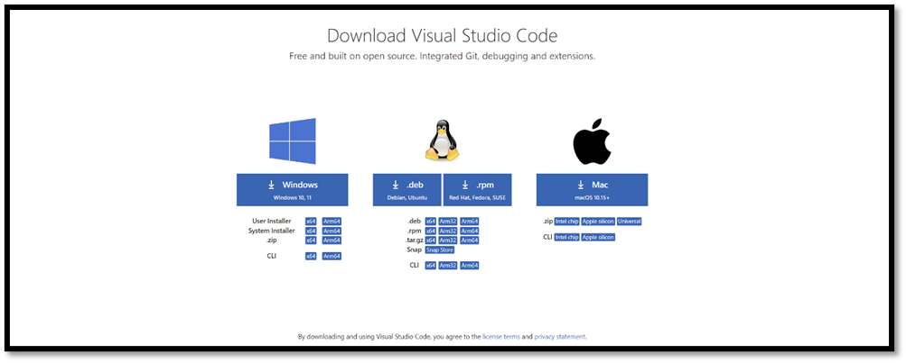
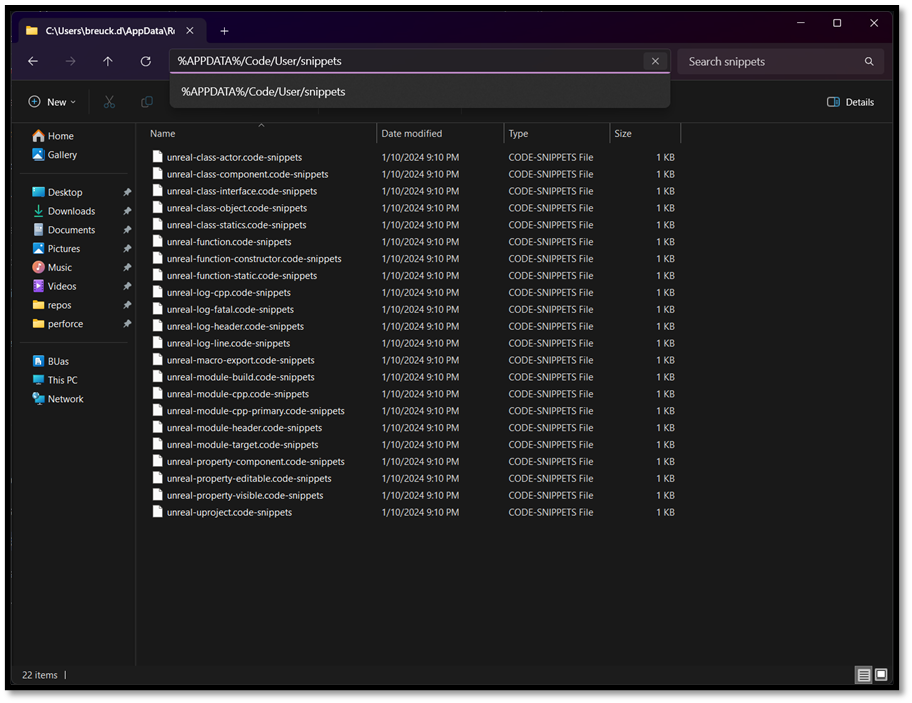
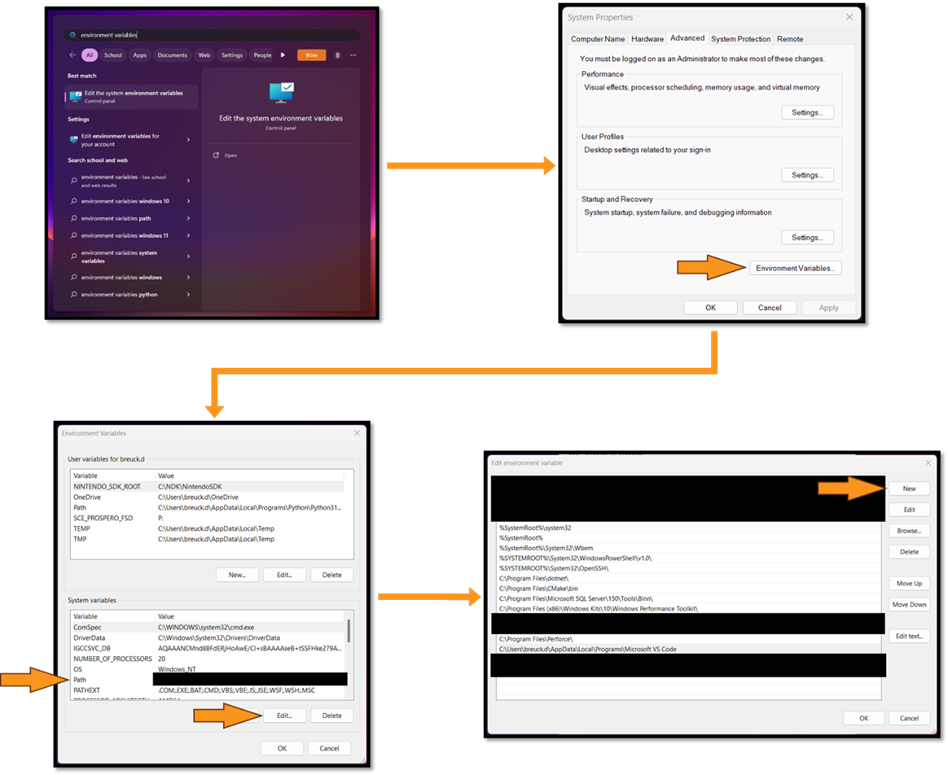

# Development Tools

Before we dive into the exciting world of game engines and compilers, let's talk about two essential tools every developer needs: a trusty text editor and a reliable terminal. And guess what? With VS Code, you get both bundled in one neat package! Now, I know there are alternatives out there like Sublime Text and Cmder, but for this walkthrough, I'll be sticking with VS Code—it's my go-to choice when working with Unreal Engine.

### Why VS Code, you ask?

Let me break it down for you. VS Code doesn't clutter your workspace, it's highly customizable to match your preferences, packed with awesome features, and incredibly lightweight and responsive. Even when dealing with massive codebases like Unreal, it won't drag you down.

### What about Visual Studio?

Unreal Engine is designed to integrate smoothly with Visual Studio, allowing you to make code changes in your projects “quickly” and easily, and “immediately” see results upon compilation but it's essential to understand that for Unreal Engine, it serves primarily as a frontend. Unreal doesn't utilize the Visual Studio “toolset” directly for building; instead, it relies on a batch script that invokes builds for your target platform. However, the Visual Studio installation comes with certain features that are required to invoke builds ( on Windows ) so in order to use VS Code we have to go through the process of installing Visual Studio.

## Installing VS Code

Here's how to get started:

- Head over to the [official VS Code website](https://code.visualstudio.com) and download the installer.
- Run the installer and follow the setup instructions.
- Once installed, let's beef up the IDE with some essential extensions:
    - C++ IntelliSense: Your coding buddy that provides smart suggestions and auto-completions.
    - Visual Studio Keymaps: For those familiar shortcuts to keep your workflow smooth.
    - Tasks: We'll get into this later.

### VS Code - Unreal Snippets

Make your life easier by setting up Unreal snippets in VS Code:

- Grab or clone the Unreal Snippets [repository](https://github.com/Dyronix/unreal-snippets-vscode) onto your machine.
- Navigate to `%APPDATA%/Code/User/snippets`.
- Paste the repository contents (excluding the .git folder) into this directory.
- Restart VS Code (if it's open) to apply the changes. 

### [Optional] VS Code - Theme

Add a touch of personality to your coding environment:

- Customize your VS Code with a sleek theme like Dracula.
- Enhance it further with vscode-icons for some visual flair.

### [Optional] VS Code - Launch from Windows Explorer (Windows Only)

For seamless integration, follow these steps:

- Open the Start menu and search for "environment variables."
- Access the "Edit the system environment variables" dialog.
- In the environment variables section, edit the PATH variable.
- Add the path to your VS Code installation directory (typically located at 
    - `C:\Users\${username}\AppData\Local\Programs\Microsoft VS Code`).
- Open the Task Manager and restart Explorer.exe to finalize the changes (this will refresh everything related to Windows Explorer).

Equipped with these essential tools, you're primed to traverse the intricacies of game development using VS Code. With precision and proficiency, let us embark on this journey into the realm of coding excellence.

## Installing Visual Studio

When it comes to installing Visual Studio, it's not as straightforward as opting for the latest version. Unreal Engine has specific requirements regarding the version of Visual Studio and its components. To determine the compatible version, you'll need to consult the [release notes](https://docs.unrealengine.com/5.0/en-US/unreal-engine-5.0-release-notes/) corresponding to your chosen version of Unreal Engine. For instance, if you're using Unreal Engine 5.0, refer to the release notes and navigate to the "Build farm" section to identify the officially supported version.

While it's not mandatory to install the exact version specified in the release notes, it's advisable for team collaboration and to minimize potential build issues. However, if you already have a newer version installed, downgrading isn't necessary, but keep in mind potential compatibility issues.

To install Visual Studio, download the installer from the [official website](https://visualstudio.microsoft.com/vs/) and run it. The Visual Studio Installer allows you to select and install various components, including the Visual C++ toolset, debugger, runtime SDKs, and more. Additionally, I recommend installing the .NET workload, as many external tools used within Unreal Engine are written in C#. This ensures compatibility and provides flexibility if you ever need to build these tools from source.

Before proceeding to the [next section](./creating_unreal_project_from_scratch.md), verify that the versions of Visual Studio, .NET package, and Windows SDK match the requirements specified in the Unreal release notes. This meticulous approach ensures a smooth development experience and minimizes compatibility hurdles down the line.
For more information about setting up Visual Studio and some additional tips and tricks on how to modify Visual Studio as an IDE, you can visit the official documentation of Unreal: [Unreal Engine: Visual Studio Setup](https://docs.unrealengine.com/4.27/en-US/ProductionPipelines/DevelopmentSetup/VisualStudioSetup/)
