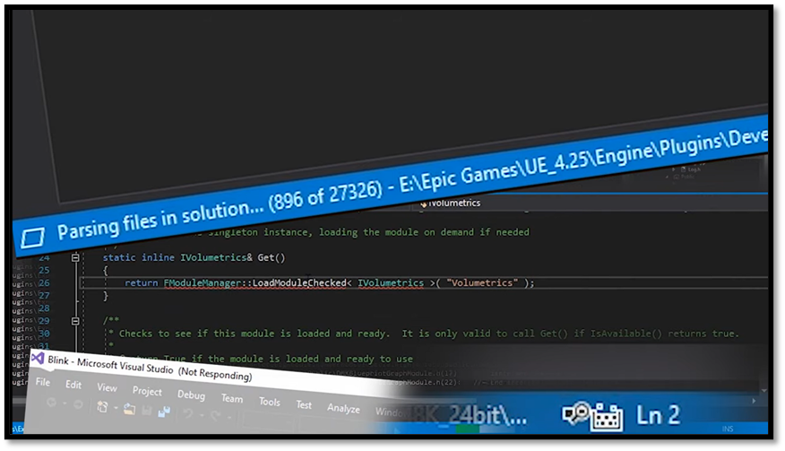

# Introduction

You don’t need to use Visual Studio to write game code in Unreal. You can generate a solution file, crack it open, and start writing code. That’s the officially supported workflow, and it’s a perfectly valid approach. It’s great for beginners since it’s an easy way to get started. However, I’ve found it also leads a lot of people to miss out on an opportunity to form an understanding of how an Unreal project fits together and how the build system works, and let’s face it, the Visual Studio experience is not everybody’s cup of tea.

Within this document I will show you how you can create an Unreal project from scratch with just a text editor. I will explain how we can build and run that project from the command line. After going through this document I hope that you get a basic understanding on what happens when you build an Unreal project. If down the line you are ever faced with a wall of cryptic error messages, you’ll have a better idea of how to diagnose the problem and get moving again.

## Conventions

**This book targets Unreal Engine 5.8.** Most of it is version-independent, since the shape of a
`.uproject` file and the job UnrealBuildTool does have not changed in years, but a handful of
values are tied to a specific release, and those are called out where they appear.

Paths are written as placeholders. Substitute your own:

| Placeholder | Meaning | Example |
|---|---|---|
| `{UE-Version}` | The engine version you installed | `5.8` |
| `{UE-Root}` | Your engine installation directory | `C:\Program Files\Epic Games\UE_5.8` |
| `{UE-BatchFiles}` | `{UE-Root}\Engine\Build\BatchFiles` | |
| `{UE-Binaries}` | `{UE-Root}\Engine\Binaries\Win64` | |
| `{projectname}` | Your project's name | `Patrol` |
| `{project_path}` | The folder containing your `.uproject` | |
| `{modulename}` | A module within your project | `Core` |

One habit is worth forming before we start, and it is the same habit the last chapter of this book
ends on. Where a value is engine-specific (build settings versions, include order versions, the
default set of trace channels), the fastest reliable answer is not documentation, it is the engine
source sitting on your disk. Documentation lags releases; the source *is* the release. Wherever this
book states such a value, it also tells you which file to read to confirm it.

But first let us [set up the environment](./development_setup.md) I use to work within Unreal.