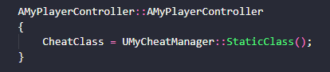
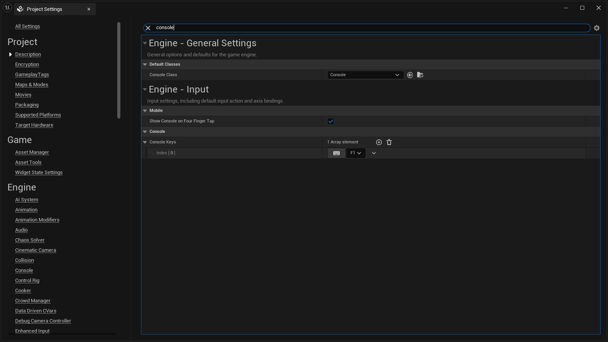

# Iteration Speed

Everything in this book so far has been about getting a project to build and run. This chapter is
about the thing you will actually spend your days doing: making a change and finding out whether it
worked.

That matters more than it sounds. Every change to C++ has to travel the same road: compile, link,
load the editor, get into play mode, navigate to the thing you changed. When that road is short you
experiment: you try the obvious fix, see it fail, try the next one. When it is long you stop
experimenting and start *reasoning about what probably happens*, because checking is too expensive.
Reasoning is slower and less reliable than looking, and it is where most wasted afternoons come from.

So the goal is not "be fast" in the abstract. It is to keep the cost of checking low enough that you
never talk yourself out of checking.

## Where the time actually goes

A full loop has roughly these stages:

| Stage | What happens | Typical cost |
|---|---|---|
| Compile | Your changed `.cpp` files are compiled | seconds |
| UHT | Reflection code is regenerated, if you touched a `UCLASS`/`UPROPERTY`/`UFUNCTION` | seconds |
| Link | Object files become a module DLL | seconds to a minute |
| Editor boot | The editor process starts and loads every module | tens of seconds |
| Map load | Your level and everything it references loads | seconds to minutes |
| Reach the thing | You walk/fly/click your way to the state you want to test | as long as you let it |

Notice that the compile, the part people think of as "the build", is usually the *cheapest* stage.
The expensive stages are the ones after it. That is why the rest of this chapter is mostly about
avoiding the editor restart and avoiding the manual navigation, not about making the compiler faster.

## Live Coding

Live Coding compiles your changed code and patches it into the **already running** editor process.
You keep the editor you already have open, the map it already loaded, and your position in it. It is on by default in a new engine
install, and it is the single biggest win available to you.

- Trigger it with **`Ctrl+Alt+F11`**, from either the editor or your IDE.
- Configure it in **Editor Preferences > General > Live Coding**.

### What it can and cannot do

The honest version, because knowing where the boundary is the difference between Live Coding being
useful and Live Coding being something you stop trusting:

**Reliable:** changing the body of an existing function. Tweaking a constant. Fixing a calculation.
Adding a log line. This is the overwhelming majority of what you do while debugging, and it is where
Live Coding shines.

**Handled, via Object Reinstancing:** adding functions, adding `UPROPERTY` members, changing class
structure. Live Coding will rebuild existing instances of affected objects so they match the new
layout. **Object Reinstancing is on by default and should stay on.** With it disabled, Live Coding
can still apply small changes, but structural ones behave unpredictably rather than failing cleanly,
which is the worst possible outcome.

**Not covered:** Live Coding is unavailable when launching on consoles and mobile devices.

**Restart anyway when:** things get strange. Live Coding patches a process that has been running and
mutating for a while. If behaviour stops making sense after several patches in a row, restart before
you spend an hour debugging a ghost. The full rebuild loop from
[Testing the Setup](./testing_the_setup.md) is your ground truth precisely because it has no state.

### Live Coding is not Hot Reload

These get conflated constantly, including in older material you will find online.

**Hot Reload** is the older mechanism. When the editor is running and you build, UnrealBuildTool
emits uniquely-numbered DLLs (`UnrealEditor-PatrolCore-0002.dll`) that the running editor loads on
top of the old ones. It works, it litters your `Binaries` folder with numbered files, and it has
largely been superseded.

**Live Coding** patches machine code in the running process instead, which is both faster and less
disruptive.

This is why the build commands in this book pass `-NoHotReload`: we are building from a terminal, we
do not want the numbered-DLL behaviour, we want plain binaries. That flag has nothing to do with Live
Coding and does not disable it.

One Live Coding preference worth turning **off** if you write code in a text editor rather than an
IDE: *Automatically Compile Newly Added C++ Classes*. It fires the moment a new class appears, which
is usually the moment the file is still empty. [Quality of Life](./quality_of_life_improvements.md)
shows how to set preferences like this once for every project instead of per project.

## Skip the editor entirely

Most of the time you do not need the editor at all, only the game. Running the game directly
skips editor UI initialisation, skips all editor-only subsystems, and gives you a much more honest
picture of performance than Play-In-Editor does:

```shell
{UE-Binaries}/UnrealEditor.exe "{project_path}/Patrol.uproject" -game -log -ResX=1280 -ResY=720
```

No cooking required: this runs against your uncooked content out of the editor binaries. See
[Open an Unreal Project](./opening_unreal_project_from_scratch.md) for the full flag table.

## Driving your code from the console

The other half of iteration speed is not rebuilding faster, it is not having to *reach* the thing you
want to test. If your bug happens in the third room after a two-minute intro, the fix is not a faster
compile. It is being able to put the game into that state on demand.

The console is how you do that, and Unreal gives you several routes into it with very different
amounts of setup.

### Exec functions

The classic approach. Tag a `UFUNCTION` with `Exec` and it becomes a console command:

```cpp
UFUNCTION(Exec, Category="Console Commands")
void GiveAmmo(int32 Amount);
```

The catch, and the reason people get stuck here, is that `Exec` functions are only routed from a
handful of classes: the `PlayerController`, the `GameMode`, the `Pawn`, the `HUD`, the
`CheatManager` and a few others. Putting `Exec` on a function in some arbitrary actor compiles fine
and then silently never fires, which is a miserable thing to debug.

The usual home for these is a **CheatManager** subclass assigned to your PlayerController. That is
also the right place for them architecturally: `UCheatManager` is only instantiated in non-shipping
builds, so your debug commands cannot accidentally ship.



### `ke`, or how to call any UFUNCTION with no setup at all

This is the one that deserves to be better known, because it removes the setup step entirely.

```
ke <ObjectName> <FunctionName>
ke * <FunctionName>
```

`ke` is short for **Kismet Event**, Kismet being Blueprints' predecessor, which is why the name
tells you nothing useful today. You can also spell it `KismetEvent`; capitalisation does not matter.

The reason to reach for it: **it works on any `UFUNCTION`**. Not just `Exec` ones. Not just
`BlueprintCallable` ones. If the function is visible to the reflection system, `ke` can call it. No
CheatManager, no `Exec` tag, no custom console command, no temporary debug UI, no button wired into a
widget just to trigger one thing.

`*` calls the function on every matching object, which is usually what you want:

```
ke * Jump
```

Parameters are positional, and struct parameters use Unreal's text format:

```
ke Character LaunchCharacter (X=0,Y=0,Z=1000) 1 1
```

The level Blueprint equivalent is `ce <EventName>`, short for *cause event*.

> **The caveat, because it will bite you.** Matching is done on the **object name**, which is not the
> same thing as the label shown in the World Outliner. They happen to coincide for the first instance
> of an actor freshly dragged into a level, which is exactly why so many people assume they are the
> same thing and then find the trick "doesn't work". The moment you have several instances of the
> same actor, the name form is ambiguous and you will get results you did not intend. Use `*`, or use
> the class name, or find the real object name first. `obj list class=YourClass` prints it, and the
> [Profiling](./profiling_uobjects.md) chapter covers that command properly.

Like most debugging facilities, `ke` is a non-shipping-build tool.

### A button in the Details panel

When clicking beats typing, particularly when a designer is going to be the one clicking,
`CallInEditor` puts a button on the actor's Details panel:

```cpp
UFUNCTION(CallInEditor, Category="Debug")
void RebuildSpawnPoints();
```

### Console variables and commands from C++

For things you want to toggle rather than trigger:

```cpp
static TAutoConsoleVariable<int32> CVarShowPatrolPaths(
    TEXT("patrol.ShowPaths"), 0,
    TEXT("Draw patrol paths in the world. 0 = off, 1 = on."),
    ECVF_Cheat);

static FAutoConsoleCommand CCmdResetPatrols(
    TEXT("patrol.Reset"),
    TEXT("Reset every patrol to its starting point."),
    FConsoleCommandDelegate::CreateStatic(&ResetPatrols));
```

Note the help text. It is not decoration, it is what the next two commands print.

### Finding out what already exists

Half the time the command you need is already there. Three ways to find it:

- `DumpConsoleCommands` lists every registered console command.
- `<cvarname> ?` prints that console variable's help text and current value. This is worth
  building a habit around; the alternative most people fall into is searching the engine source for
  the variable name, which works but takes a hundred times longer.
- `DumpCVars` writes every console variable and its current value to the log. Usually far too much
  to read directly, but exactly right when you want to diff two configurations.

### Two more commands

- **`DumpTicks`** lists every actor currently ticking. When something is costing frame time and you
  do not know what, this is often a one-line answer: things tick that nobody meant to leave ticking.
- **`BugIt`** puts a `BugItGo` command on your clipboard containing your exact camera position and
  rotation. Paste it into a bug report and whoever picks it up lands on the repro instead of hunting
  for it. We use this again in [Profiling](./profiling.md) to make captures repeatable, which is the
  other place "get back to exactly there" matters.

### Bake commands into your launch

Console commands can be run automatically at startup, which closes the loop nicely with the batch
files from [Quality of Life](./quality_of_life_improvements.md):

```shell
{UE-Binaries}/UnrealEditor.exe "{project_path}/Patrol.uproject" -game -log -ExecCmds="patrol.ShowPaths 1, ke * StartPatrol"
```

Put that in `run_editor.bat` and every launch lands directly in the state you are testing. This is
the highest-leverage item in the chapter and the one people reach for last: if you are typing the
same three console commands after every launch, stop typing them.

### Fixing the console key

Unreal opens the console with `` ` `` by default, and on many non-US keyboard layouts that key either
does not exist or does not register. You can rebind it per project in the editor:



But rebinding it once for every project and every Unreal game on your machine is better. See
[Quality of Life](./quality_of_life_improvements.md#settings-that-follow-you-between-projects).

## UFUNCTION specifiers that remove plumbing

Since this chapter is about not doing unnecessary work, three specifiers that remove it. They do not
speed up your build; they delete work from every call site forever, which adds up to more.

```cpp
// A bool return becomes true/false execution pins, instead of every caller
// wiring a Branch node immediately after the call.
UFUNCTION(BlueprintCallable, meta=(ExpandBoolAsExecs="ReturnValue"))
bool TryConsumeAmmo(int32 Amount);

// The Target pin defaults to self, instead of every caller dragging in a self node.
UFUNCTION(BlueprintCallable, meta=(DefaultToSelf="Target"))
static void ApplyPatrolDebugTint(AActor* Target);
```

And on a property, `BlueprintGetter` / `BlueprintSetter` route Blueprint's get and set nodes through
your own C++ accessors:

```cpp
UPROPERTY(BlueprintGetter=GetHealth, BlueprintSetter=SetHealth)
float Health;
```

This one is quietly powerful. Every Blueprint graph that already reads or writes that variable keeps
working unchanged, but now goes through your function, so you can add clamping, invalidation or a
change notification to a variable that is already used in fifty places, without touching any of them.

## Build speed

Finally, the compile itself. Two things affect it:

- **`BuildConfiguration.xml`**, at `%APPDATA%\Unreal Engine\UnrealBuildTool\`, holds
  UnrealBuildTool's machine-wide defaults, including `bUseUnityBuild`, which controls whether source
  files are concatenated into larger translation units before compiling. Unity builds make full
  builds much faster and single-file rebuilds somewhat slower, which is a trade that can go either
  way depending on how you work.
- **Unreal Build Accelerator (UBA)** distributes compilation. `bAllowUBALocalExecutor` uses the cores
  you have more aggressively; `bAllowUBAExecutor` distributes across a Horde cluster if your studio
  runs one. (An older `bAllowUBA` flag exists in material you may find online and is no longer wired
  up to executor selection, another case where reading the current source beats reading an old blog
  post.)

## Which tool for which change

| You changed | Use |
|---|---|
| A function body, a constant, a log line | Live Coding (`Ctrl+Alt+F11`) |
| Added a `UPROPERTY` or a new function | Live Coding; reinstancing handles it, but restart if it gets strange |
| A header that most of the project includes | Full rebuild; Live Coding has nothing small to patch |
| `.Build.cs` / `.Target.cs` | Full rebuild, because these are build system inputs, not code |
| Nothing, but you need the game in a different state | The console: `ke`, an `Exec` function, or `-ExecCmds` |
| Nothing, but you need to be back at a specific spot | `BugItGo` |

The next chapter, [Testing the Setup](./testing_the_setup.md), puts the baseline loop into practice.
