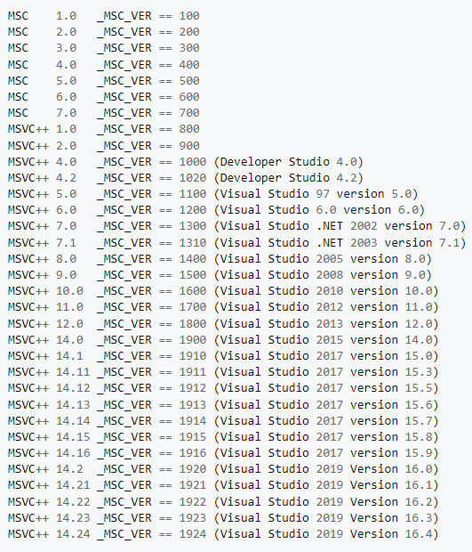
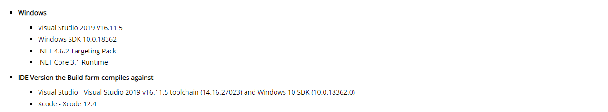
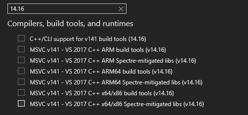
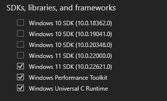
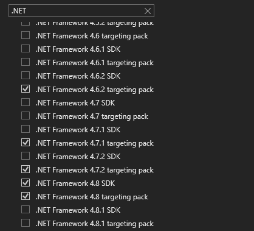
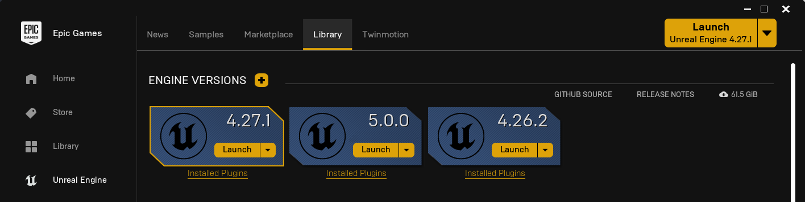
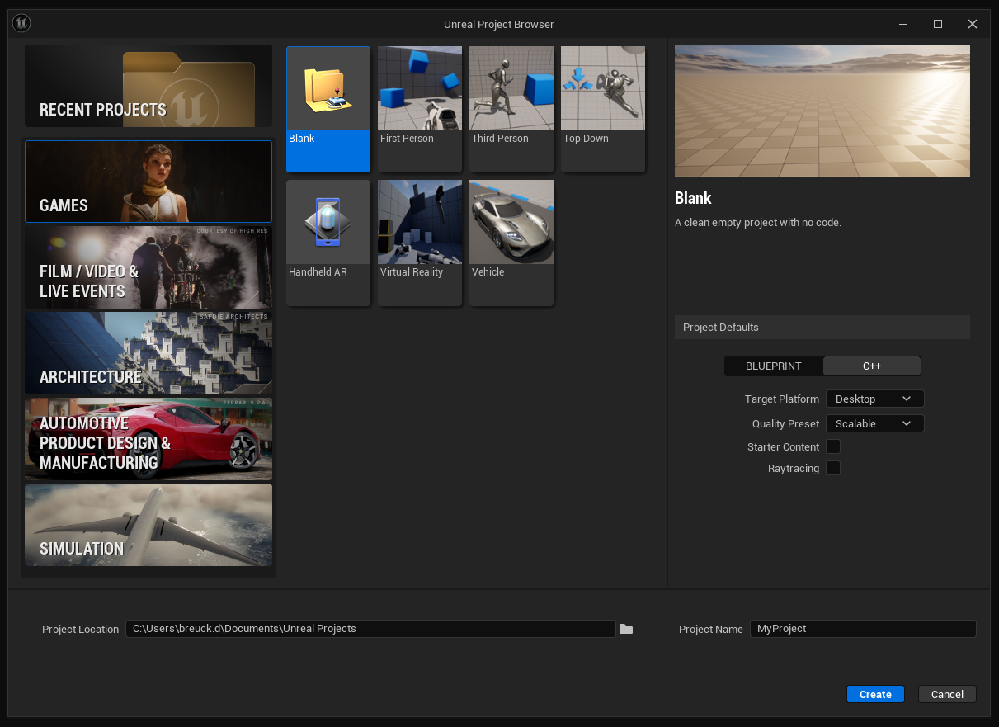
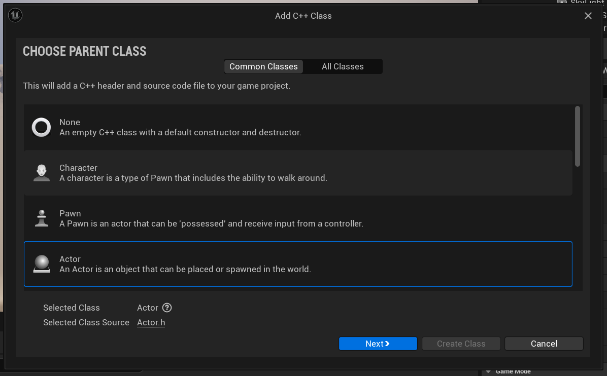
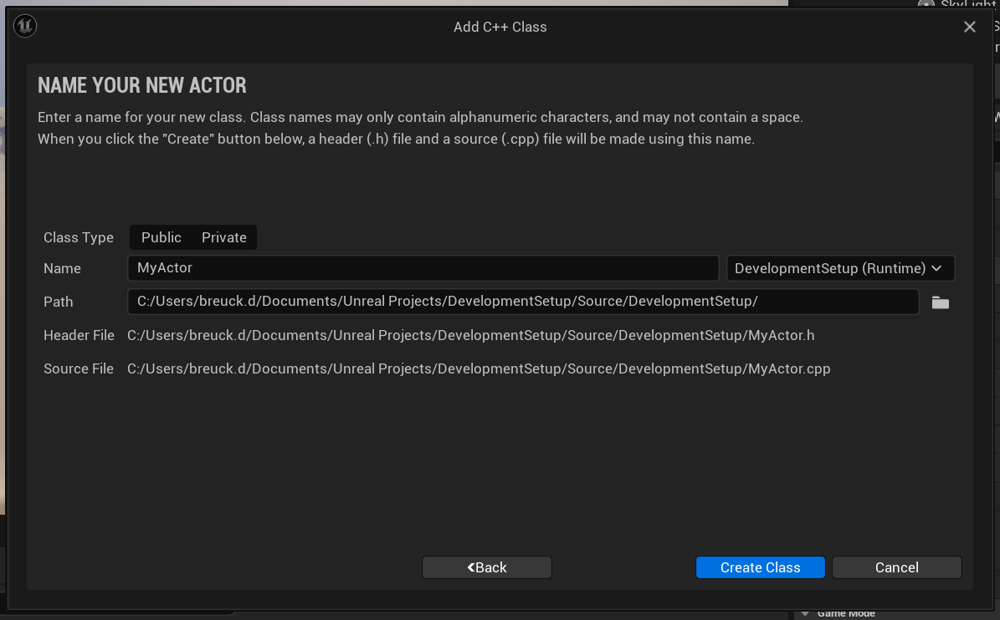

# Official Workflow

In contrast to the custom workflow, I will demonstrate how game code can be written using Visual Studio, which you should be familiar with already. If we started completely from scratch, most people would install the newest version of Visual Studio that looks recommended and move on. But we are not most people. We are going to pay attention to specific versions, because Visual Studio versioning is confusing: the product year, the toolset version and the MSVC compiler version are three different numbers that do not match each other.

## Installing Visual Studio

To figure out which version of Visual Studio to install, check what Epic documents for the engine version you are using. The two pages that carry this are [Hardware and Software Specifications](https://dev.epicgames.com/documentation/en-us/unreal-engine/hardware-and-software-specifications-for-unreal-engine) and [Setting Up Visual Studio Development Environment for C++ Projects](https://dev.epicgames.com/documentation/en-us/unreal-engine/setting-up-visual-studio-development-environment-for-cplusplus-projects-in-unreal-engine). Whatever they list is what Epic actually built and tested this release against, which is not always the newest thing available.

For Unreal Engine 5.8 that is **Visual Studio 2026** for general development, with **.NET 10.0**. Visual Studio 2022 17.14 or later still works, and is still the required option for Nintendo platforms and for AGDE below v26.1.102.

Installing that exact version is not a hard requirement. If you already have a newer one, you do not need to downgrade. Just remember it as a suspect: when Visual Studio starts behaving oddly or a build fails for no visible reason, the toolchain version is worth checking early. Within a team, everyone having the same build tools removes a whole class of problems that otherwise look like bugs in your code. You can download Visual Studio from the official [website](https://visualstudio.microsoft.com/vs/)

After the installer is downloaded we can open it. The Visual Studio Installer is what actually delivers the traditional Visual C++ toolset: the compiler, linker, build tools, the debugger and the runtime platform SDKs. Alongside *Desktop development with C++* and *Game development with C++*, install the **.NET desktop development** workload as well. A lot of the tooling inside Unreal is written in C#, UnrealBuildTool and UnrealHeaderTool among them, so .NET is not optional decoration, it is what runs your build.

Epic asked for specific versions, and the **Individual components** tab of the installer is where you confirm you actually have them. Three things are worth checking: the Visual Studio version itself, the .NET version, and the Windows SDK version.

*The screenshots below were captured against an older release and the version numbers in them will not match what you need. Use the documentation pages linked above as the source of truth, not the screenshots.*

## Setting up a project in Unreal

Next up, I am going to assume you also have Unreal already installed, but for good measure let's see how we could do this because there are 2 ways to install Unreal. You could clone the complete Engine source from GitHub and build it yourself or you can install a pre-built version using the [Epic Games Launcher](https://store.epicgames.com/en-US/download)

If you would like to make changes to the engine itself, cloning and building is the way to go, but the Launcher makes it easy to get things up and running, so that is what we will use for now. Everybody has an Epic Games account, so we can sign in and get Unreal from there. Be aware that a modern engine install is large: tens of gigabytes downloaded, and well over a hundred once installed if you include debugging symbols. The Launcher shows you the current figures before you commit, so check there rather than trusting a number printed in a book.
When we create the project, Unreal generates a new project directory and populate it with a .uproject file as well as Config, Content and Source directories. It will generate a visual studio solution for us and it begins build our project from source. When it's done we end up with an editor DLL for our project, and the editor then loads that module and opens up the project. Let’s take a look at how we could achieve this.

- Create a new project using the Epic Games Launcher

- Choose the project type
- Select the target platform
- Select the quality preset
- Enable/Disable starter content
- Enable/Disable raytracing
- Choose a path to save the project

## Extending an Unreal Project

Unreal also has some tools for integrating and generating source files which are similarly great for making the development process discoverable for beginners. If we want to add a new class, we can choose New C++ class from the menu, make it an Actor class and call it MyActor. Unreal will create the source files update our Visual Studio project, compile and reload the project DLL and bring Visual Studio to the foreground. This will give us some nice boiler plate with "useful" comments so we will never forget what "Tick" means. And I have to give credit where credit is due, it works, it's fine. It's meant to make this process accessible and it does a great job at that.

- We can create a new actor class from the editor
    - Menu Bar > Tools > new C++ class
- Specify a class type such as Actor

- Specify a name for the class eg: "MyActor"
- Specify a path to store our new class type

