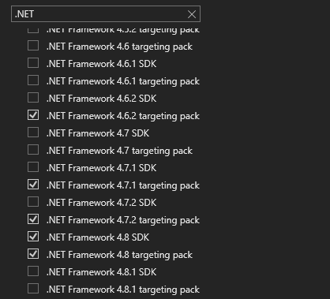
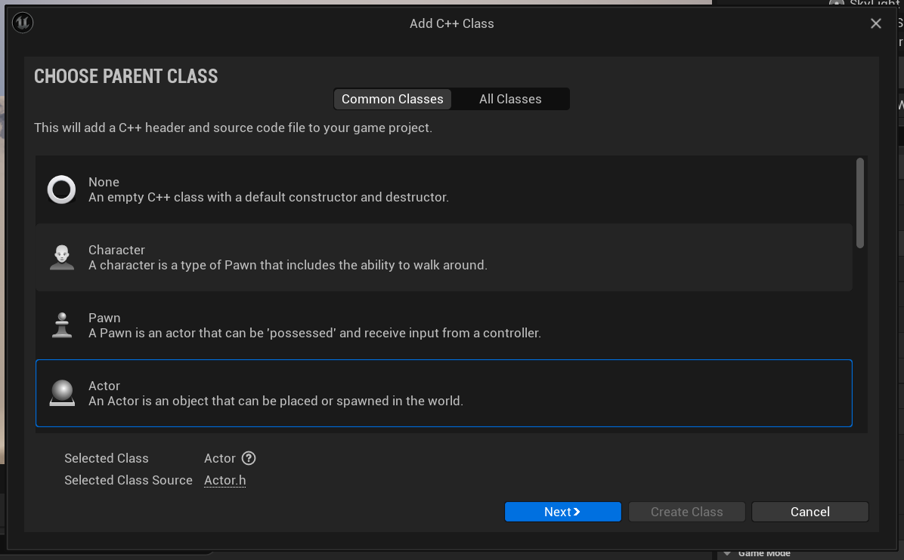

# Official Workflow

In contrast to the custom workflow, I will demonstrate how game code can be written using Visual Studio which you should be familiar with already. If we would start completely from scratch, most people will install the newest version of Visual Studio that is “recommended” for this version and move on. But we are not most people. We are going to pay attention to specific versions, and Visual Studio versions can become a bit confusing.

## Installing Visual Studio

To figure out what version of Visual Studio we have to install we have to look at the release notes of the version of Unreal you would like to use. I’m using Unreal 5.0, if we navigate to the this link and look for “Build farm”. We’ll see what version is officially supported. This may not be the latest version, but this is what Epic tested against for this release.

It's not a hard requirement for you to install this specific version, meaning if you already have a newer version installed you don't have to downgrade to an older version just remember if you have issues using Visual Studio you might want to check the version. Although when you are working within a team, making sure that everybody has the same build tools is a good way to avoid build problems. You can download Visual Studio from the official [website](https://visualstudio.microsoft.com/vs/)

After the installer is downloaded we can open it. The Visual Studio Installer will be used to install the traditional Visual C++ toolset, including the compiler, linker, build tools, the debugger and the runtime platform SDKs. What I recommend when installing Visual Studio using the Visual Studio installer is to install the .NET workload as well (if you don't you can also download and install manually if it turns out you need it).A lot of external tools used within Unreal are written in C#, including the Unreal build system itself, so if you ever need to build those from source, the .NET tools will come in handy.

Remember that the release notes of Unreal requested a specific version, within the individual components of the Visual Studio installer we can check that those specific versions are installed. The products that we need to check are the version of Visual Studio itself, the .NET package and the Windows SDK. ( your versions may vary from the screenshots, please use the Unreal release notes to verify your version )

## Setting up a project in Unreal

Next up, I am going to assume you also have Unreal already installed, but for good measure let's see how we could do this because there are 2 ways to install Unreal. You could clone the complete Engine source from GitHub and build it yourself or you can install a pre-built version using the [Epic Games Launcher](https://store.epicgames.com/en-US/download)

If you would like to make changes to the engine itself cloning and building is the way to go, but the Launcher makes it easy to get things up and running so that's what we will use for now. Everybody has an Epic Games account so we can "Sign In" and get the latest version of Unreal. Remember the download is about 17GB and it will take up 56GB once installed so make sure you have space when using Unreal (without debugging symbols included).
When we create the project, Unreal generates a new project directory and populate it with a .uproject file as well as Config, Content and Source directories. It will generate a visual studio solution for us and it begins build our project from source. When it's done we end up with an editor DLL for our project, and the editor then loads that module and opens up the project. Let’s take a look at how we could achieve this.

- Create a new project using the Epic Games Launcher

- Choose the project type
- Select the target platform
- Select the quality preset
- Enable/Disable starter content
- Enable/Disable raytracing
- Choose a path to save the project

## Extending an Unreal Project

Unreal also has some tools for integrating and generating source files which are similarly great for making the development process discoverable for beginners. If we want to add a new class, we can choose New C++ class from the menu, make it an Actor class and call it MyActor. Unreal will create the source files update our Visual Studio project, compile and reload the project DLL and bring Visual Studio to the foreground. This will give us some nice boiler plate with "useful" comments so we will never forget what "Tick" means. And I have to give credit where credit is due, it works, it's fine. It's meant to make this process accessible and it does a great job at that.

- We can create a new actor class from the editor
    - Menu Bar > Tools > new C++ class
- Specify a class type such as Actor

- Specify a name for the class eg: "MyActor"
- Specify a path to store our new class type

