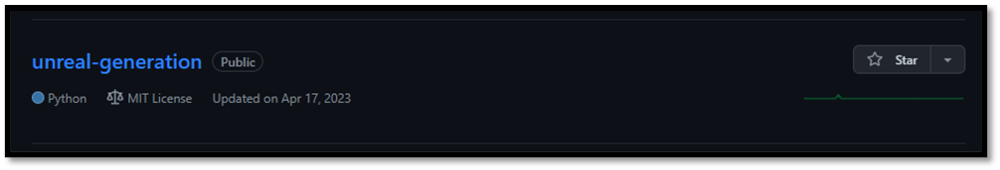
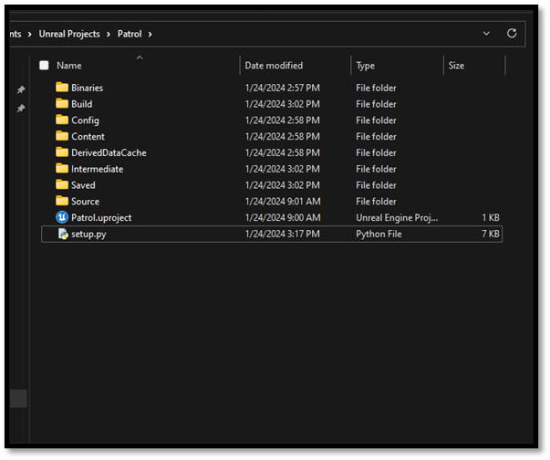
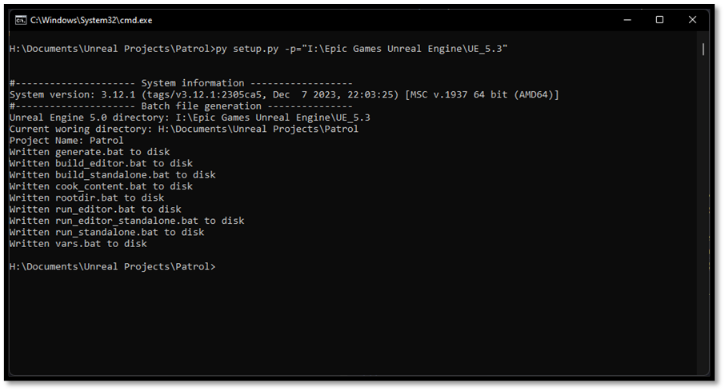
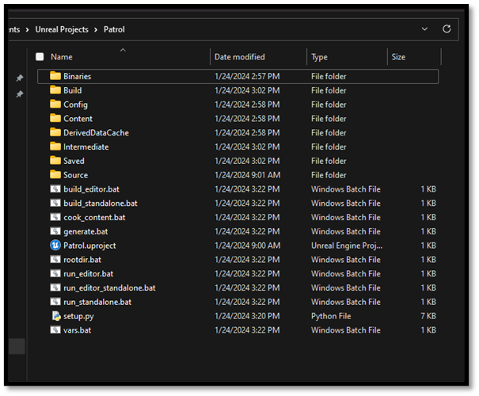
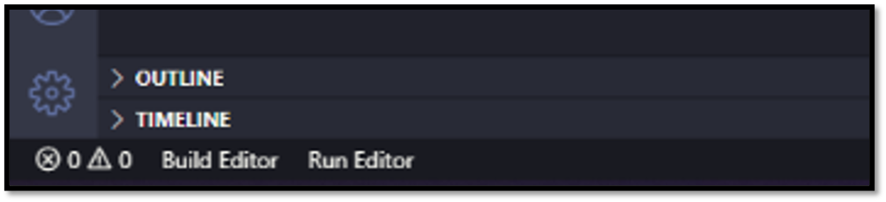

# Quality of Life

In the [previous section](./running_a_game.md) we noticed that there are a lot of commands we have to enter to work with Unreal from the command line. This however will only slow us down rather than improve iteration speed. Luckily, we as developers can remedy this by introducing a quick fix and make our own batch files that invoke these commands. I will not bore you with writing these files yourself as we did with the snippets for VS Code you can download a script from [this GitHub repository](https://github.com/Dyronix/unreal-generation) that will setup these files for you. I know batch files aren't really the state of the art in build automation, but we're not doing anything fancy here, so this approach works fine. Feel free to upgrade it to your liking.

## Additional Unreal Batch Files

[](https://github.com/Dyronix/unreal-generation)

-	Download/Clone the repository to disk
-	Copy the contents of the repository (except the .git folder)
-	Go to ${project_path}
-	Paste repository contents



-	Run `setup.py -p=${ue5_path}`
    -	e.g. `py setup.py -p="C:\Program Files\Epic Games\UE_5.8"`



-	Batch scripts to run the Unreal commands should have been generated



What's great about using the command-line is that we can easily chain multiple commands together. If we run `build_editor && run_editor`, that will build and if and only if the build succeeds, it'll launch the editor. This lets us jump quickly back and forth between code and editor.

## VS Code Tasks

An extension that was installed in the [development setup](./development_setup.md) chapter was called VS Code Tasks. Now that the batch files have been created we can setup these tasks. You see you can specify certain commands within VS Code without using the terminal. It's like having the "Run" button of Visual Studio but better.



- Create .vscode folder in your {project_directory}
- Add a `tasks.json` file to this folder
- Fill the contents of this file with commands you would like to execute
- Created tasks will end up at the bottom of the IDE

An example `tasks.json` looks as follows. Note the `"group"` field: setting it to `"build"` on one
task makes **Ctrl+Shift+B** run that task directly, which is built into VS Code and needs no
extension at all. The Tasks extension adds the status-bar buttons, but you are not stuck if it is
unavailable.

```json
{
    "version": "2.0.0",
    "tasks": [
        {
            "label": "Build Editor",
            "type": "shell",
            "command": "./build_editor.bat",
            "windows": {
                "command": "./build_editor.bat"
            },
            "group": "build",
            "presentation": {
                "reveal": "always",
                "clear": true
            }
        },
        {
            "label": "Run Editor",
            "type": "shell",
            "command": "./run_editor.bat",
            "windows": {
                "command": "./run_editor.bat"
            },
            "group": "none",
            "presentation": {
                "reveal": "always",
                "clear": true
            }
        },
    ]
}
```

## Settings that follow you between projects

Some preferences are not worth setting again in every project you ever open. Unreal reads config
files out of `Documents\Unreal Engine\Engine\Config\`, and anything you put there overrides the
corresponding setting for **every project, every engine install, and every shipped Unreal game on
that machine**. The files are named with a `User` prefix: `UserEditorPerProjectUserSettings.ini`
for editor preferences, `UserInput.ini` for input.

The most useful one for this book is the console key. Unreal opens the console with `` ` `` by
default, and on a lot of non-US keyboard layouts that key either does not exist or does not register.
Rather than rebinding it per project through the editor UI:

```ini
; Documents\Unreal Engine\Engine\Config\UserInput.ini
[/Script/Engine.InputSettings]
+ConsoleKeys=Insert
```

Now every Unreal project you open, and every Unreal game you play, opens its console with `Insert`.

*Gotcha: these get cached into `{project_path}/Saved/Config/WindowsEditor/Input.ini`. If a change
here does not seem to take effect, delete that cached file. It regenerates.*

## Naming your generated solution

If you work on more than one branch or engine version, you will end up with several generated
solutions all called `UE5.sln`, and no way to tell which window is which. UnrealBuildTool reads a
machine-wide config file at `%APPDATA%\Unreal Engine\UnrealBuildTool\BuildConfiguration.xml`
(this is the file that actually exists; you will see older material refer to a
`BuildConfiguration.cs`, which does not):

```xml
<?xml version="1.0" encoding="utf-8" ?>
<Configuration xmlns="https://www.unrealengine.com/BuildConfiguration">
    <ProjectFileGenerator>
        <bPrimaryProjectNameFromFolder>true</bPrimaryProjectNameFromFolder>
    </ProjectFileGenerator>
</Configuration>
```

The solution is now named after its parent folder, so the title bar tells you which checkout you are
looking at. The same file is where you would change UnrealBuildTool's other defaults. See the
[Build Configuration documentation](https://dev.epicgames.com/documentation/en-us/unreal-engine/build-configuration-for-unreal-engine)
for what else lives there.

Now everything is in place to start working on our new project, in the [next section](./testing_the_setup.md) we will test the setup we created with a simple example.