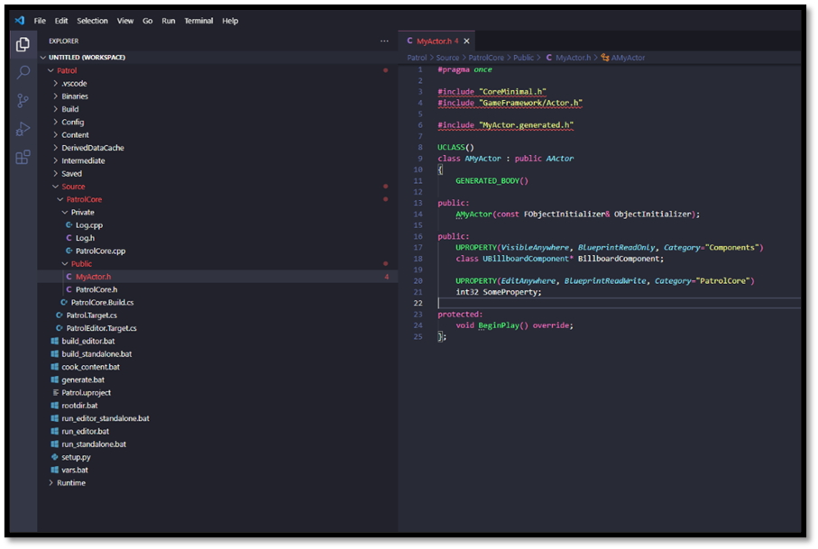
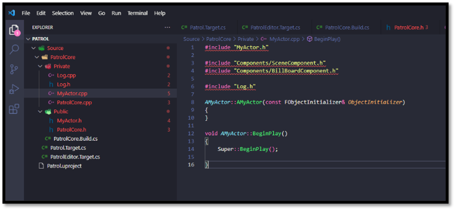
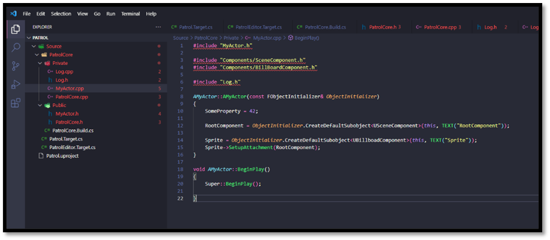
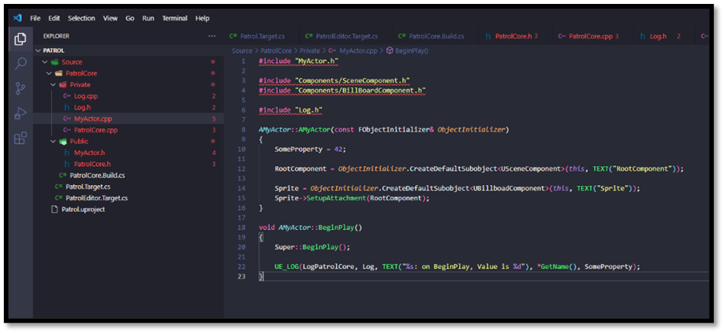
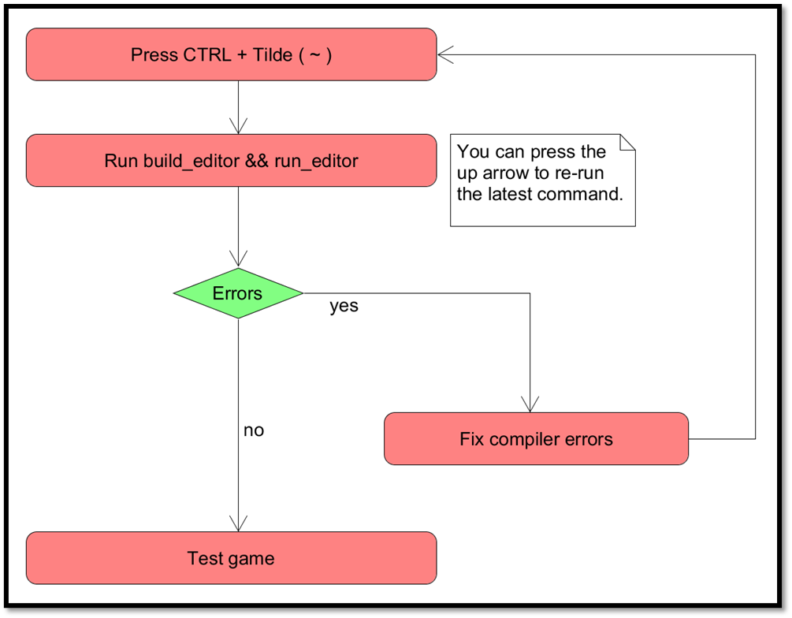
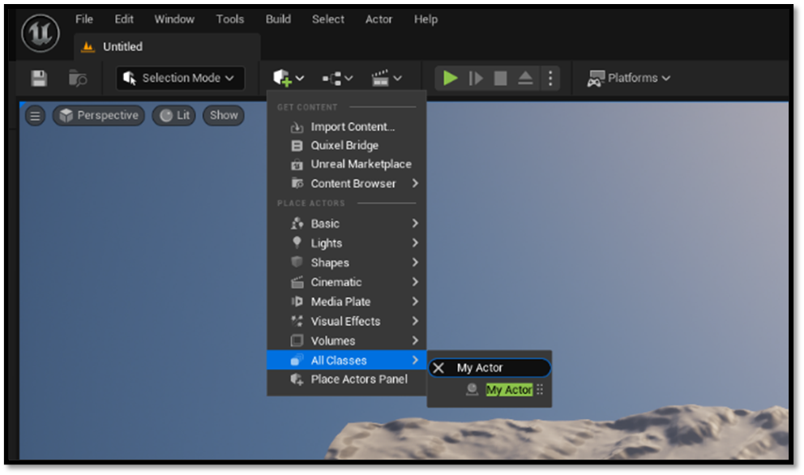
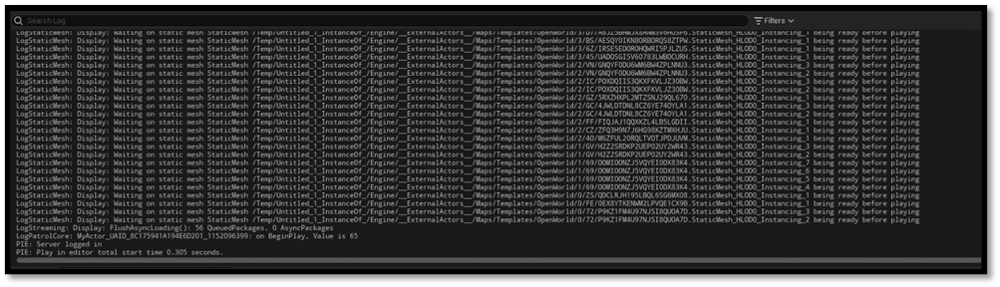

# Testing the setup

Tools are only worth having if they work, otherwise this entire document is kind of useless. So here is a practical example to check ours with: introducing a new `AActor` instance. We'll attach a `UBillboardComponent` to it and initialize a property to a predefined value for demonstration purposes.

## Adding the Actor

- Add a new Public header file called MyActor.h to your Module
    - Use the snippet **uca** to autocomplete this file
-	Add a new component property for our `UBillboardComponent`
    -	Use **upc** snippet
-	Add a new editable property, so we can tweak a value
    -	Use **upe** snippet
-	Override `BeginPlay`
-	Declare a constructor
    -	Use **ufc** snippet

When complete our header file should look like this: 

- Add a new Private source file called MyActor.cpp to your module
- Create the constructor
- Create the `BeginPlay` function
- Include required files

*Note: the constructor below uses `FObjectInitializer` to create its components. That still works and
is worth recognising, but the form you will see far more often in engine code and in Epic's templates
is `CreateDefaultSubobject<T>(TEXT("Name"))`, which does the same job without taking the initializer
explicitly. Either is fine; do not be surprised when the two appear side by side in the same
codebase.*

- Use the `FObjectInitializer` to create a root `USceneComponent`
- Use the `FObjectInitializer` to create a `UBillboardComponent`
- Attach the `UBillboardComponent` to the root `USceneComponent`
- Assign a default value to the editable property

- Include the modules `Log.h` file
- In `BeginPlay` use the snippet **ull** to add a log line
- Log the name of the `AActor` and the integer value of the property we created

## The iteration loop

Every change you make to C++ has to travel the same road before you can see whether it worked:
compile, link, load the editor, get into play mode, reach the thing you changed. If that road is
thirty seconds long you will experiment freely. If it is five minutes long you will start guessing
instead of checking, and guessing is where bugs come from.

So the loop below is deliberately the *slow, always-correct* one: a full rebuild and a fresh
editor. It is the baseline: it works for every kind of change, including the ones that reshape
classes. Once you trust it, the [Iteration Speed](./iteration_speed.md) chapter shows you how to cut
most of it away with Live Coding and how to drive code from the console without restarting anything.

Our development iteration loop looks as follows:

- Press CTRL + Tilde (~)
- Run `build_editor && run_editor`
- Check for any errors
    - If and only if there are errors
        - Fix compiler errors
        - Press CTRL + Tilde (~)
        - Press up arrow in the terminal
        - Press enter
- Rinse and repeat

*Note: once the editor is open and you are only changing the body of a function, you usually do not
need to run this loop at all. `Ctrl+Alt+F11` recompiles and patches the running editor in place.
See [Iteration Speed](./iteration_speed.md) for when that is safe and when it is not.*

## Testing our code

To ensure the effectiveness of our code, we should test it. We'll accomplish this by opening the Editor and placing an instance of our `AActor` within the scene. This step allows us to validate the functionality of our `AActor` implementation in a real-world environment.

Once the `AActor` is positioned within the scene, adjustments to its predefined properties can be made. Subsequently, initiating gameplay by pressing the play button enables close monitoring of the output window. Here, a logging functionality has been integrated within the code to present information regarding the `AActor`, encompassing its name and the property value.

To [conclude](./conclusion.md) ...